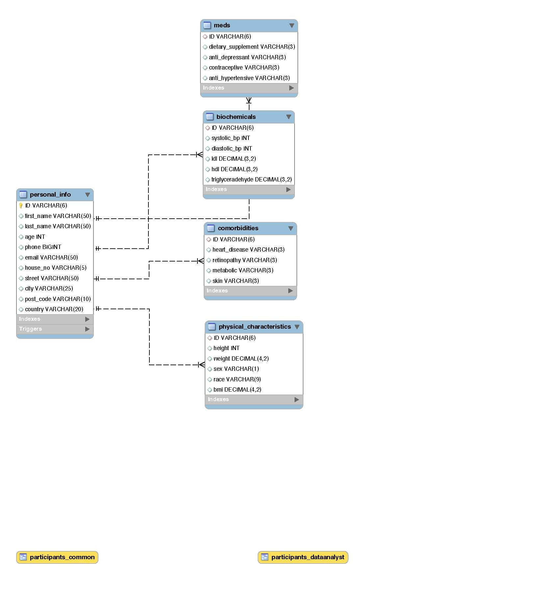

# CFG Introduction to Data and SQL Project

My idea for this was to create a sort of patient information database. For example, if you want to conduct a study and collect data about patients in your study. The mock database contains five tables:

| Table Name               | Columns                                                                        |
|--------------------------|--------------------------------------------------------------------------------|
| personal_info            | ID, first_name, last_name, age, phone, email, address (house no, street, town, |
| physical_characteristics | ID, height, weight, gender, race, BMI                                          |
| biochemical              | ID, blood_pressure, ldl, hdl, triglyceradehyde                                 |
| comorbidities            | ID, heart_disease, retinopathy, metabolic, skin                                |
| meds                     | ID, dietary_supplement, anti-depressant, contraceptive, anti-hypertensive      |

ID is the primary key and creates relations between the tables. The DB diagram



## Creating a view

I created a view (participant_common) to show the age, sex and comorbidities. This fetches data from three tables: age (personal_info table), sex (physical_characteristics table) and comorbidities (comorbidities table):

``` sql
CREATE VIEW participants_common AS
SELECT 
c.*, 
physical.gender,
personal.age
FROM comorbidities c
INNER JOIN physical_characteristics physical ON c.ID = physical.ID
INNER JOIN personal_info personal ON c.ID = personal.ID
```

## Creating a stored function

One of the metrics which can be inferred from the weight and height of participants is their body mass index (BMI). Hence, I created a stored function which calculates the BMI using weight and height in the physical_characteristics table.

``` sql
DELIMITER //
CREATE FUNCTION bmi_calc (weight DECIMAL, height INT)
RETURNS DECIMAL(4,2) DETERMINISTIC
BEGIN
    DECLARE bmi VARCHAR(10);
    SET bmi = ROUND(weight/POWER(height/100, 2), 2); 
    RETURN (bmi);
END//
DELIMITER ;
```

-- call the function select height, weight, ID, bmi_calc(weight,height) BMI from physical_characteristics;

## Creating a Stored Procedure

I created a stored procedure for inserting new data into the personal_info table, so that when called, the new data can be inserted straightaway without having to define the column names.

``` sql
DELIMITER //
CREATE PROCEDURE newEntry(
IN `ID` VARCHAR(6),
IN `first_name` VARCHAR(50),
IN `last_name` VARCHAR(50),
IN `age` INT,
IN `phone` BIGINT,
IN `email` VARCHAR(50),
IN `house_no` VARCHAR (5),
IN `street` VARCHAR(50),
IN `city` VARCHAR(25),
IN `post_code` VARCHAR(10),
IN `country` VARCHAR(20))
BEGIN
INSERT INTO
personal_info(ID,first_name,last_name,age,phone,email,house_no,street,city,post_code,country)
VALUES (ID,first_name,last_name,age,phone,email,house_no,street,city,post_code,country);
END//
DELIMITER ;

-- calling the Procedure
CALL newEntry (
'BS06',
'Baek',
'Sehee',
30,
09134563,
'baeksehee@tteokbokki.com',
45,
'tteokbokki',
'seoul',
'SE1 BS6',
'SK'
);
```

## Update Table

I wanted to update the physical characteristics table to include the BMI. This is a two-step process. First, I altered the table to insert a new column (bmi), this is automatically filled with null data.

``` sql
-- alter physical characteristics table to include bmi column
ALTER TABLE physical_characteristics
ADD bmi DECIMAL (4,2);
```

Then I updated the table to add the bmi calculation using the bmi_calc function defined earlier.

``` sql
-- update physical characteristics table to include bmi
UPDATE physical_characteristics
SET bmi = bmi_calc(weight,height);
```

## Creating a complex query

To create a query with a subquery to show biochemicals table for those with bmi \< 30

``` sql
SELECT* FROM biochemicals
WHERE ID IN (
SELECT ID FROM physical_characteristics 
WHERE bmi < 30);
```

Although the above code returns those with bmi \< 30, it however does not display their BMI. To do this:

``` sql
SELECT b.*,
physical.bmi
FROM biochemicals b
JOIN physical_characteristics physical ON b.ID = physical.ID
WHERE b.ID IN (
SELECT ID FROM physical_characteristics 
WHERE bmi < 30);
```

## Creating a Trigger

I created a trigger to format the email addresses to lower case

``` sql
-- a trigger to set email in lower case
DELIMITER //
CREATE TRIGGER emailFont
BEFORE INSERT ON personal_info
FOR EACH ROW
BEGIN
    SET NEW.email = CONCAT(LOWER(SUBSTRING(NEW.email FROM 1)));
END//
DELIMITER ;
```

To test the trigger, I inserted a new entry using the newEntry procedure defined earlier.

``` sql
-- Testing the newEntry trigger
CALL newEntry (
'BS07',
'Baek',
'Sehee',
30,
09134563,
'BAEK@tteokbokki.com',
45,
'tteokbokki',
'seoul',
'SE1 BS6',
'SK'
);

-- view personal_info table
SELECT* from personal_info;
```

## Creating a view with a result set for analysis

Suppose you are a researcher collecting and storing information about patients, and you want to send your data to your data analyst or bioinformatician to analyse. The onus falls on you to remove identifiable information of the patients. So I created a view called participants_dataAnalyst to include all the patient data without identifiable information. Since the database also now has a calculated bmi column, I left out the height and weight column.

``` sql
-- A view to merge all tables but hide identifiable info
CREATE VIEW participants_dataAnalyst AS
SELECT 
c.*, 
physical.sex, physical.race, physical.bmi,
personal.age,
b.ldl, b.hdl, b.triglyceradehyde,
m.dietary_supplement,m.anti_depressant,m.contraceptive,m.anti_hypertensive
FROM comorbidities c
INNER JOIN physical_characteristics physical ON c.ID = physical.ID
INNER JOIN personal_info personal ON c.ID = personal.ID
INNER JOIN biochemicals b ON c.ID = b.ID
INNER JOIN meds m ON c.ID = m.ID;

SELECT* FROM participants_dataAnalyst; 
```
